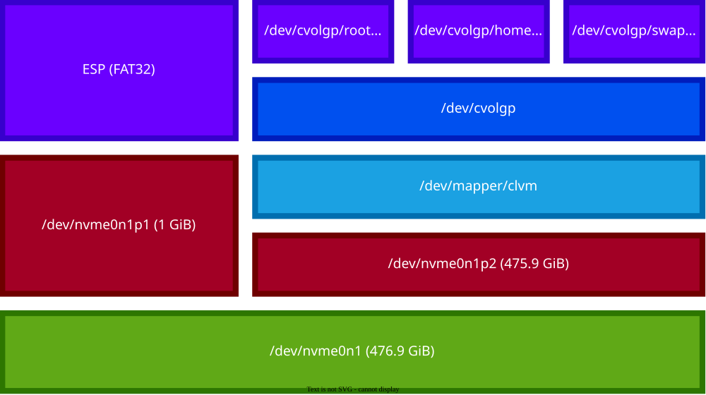

In this tutorial blog, we are going to go through the steps needed to set up an encrypted Arch Linux installation. You can follow this tutorial to reproduce the exact setup or modify it according to your needs, and most likely you have to. That's what Arch Linux is about. I'm setting up my system in a way that works best for me, but it might or might not work for you. Regardless of whether you have a preference or you're a beginner, you can still learn a lot from going through the installation procedure.

## Why did I get into Linux

**Trying for the first time**

About three years ago, I decided to try out Linux on my school-issued laptop. At that time, the intention was to kind of get a feel for a different system other than Microsoft Windows, which I had exclusively used up to that point. I didn't want to replace my current system entirely or mess around with dual-booting due to space constraints, so I ran it in a VirtualBox VM. I required something lightweight, so I picked Linux Lite, a distribution based on Ubuntu LTS. First impressions: it seemed a little crude, unaesthetic, and even uncomfortable to use. In other words, it was different. Subconsciously, I knew there was something special about it.

**The realization**

I was surprised at how fast it ran as a VM on my ThinkPad E495 with a Ryzen 3. It was simple, the UI was coherent, and it didn't feel like something was constantly shoving ads in your face (although inherently a feature of the desktop environment). It felt serene. At that point, I kind of knew that a Linux-based system was going to run on all my machines for the foreseeable future. I just needed to first get a broad overview of Linux's weaknesses to make the eventual transition smoother. That includes figuring out what software isn't well-supported or isn't supported at all, learning how to perform day-to-day tasks, and generally getting a sense of what I prefer in an operating system (i.e., the choice of distro).

**Going forward**

I reserved my Linux experiments for my laptop only, and tried installing different distributions during my pastime. At that point, I was hit with the dilemma that most people starting out with Linux face. How do I learn to use this system to its full extent? I didn't want to just learn how to get by; I wanted to master it. The problem was the fragmented nature of Linux. The idea of different distributions, desktop environments, terminal emulators, and shells to name a few. Even the bootloader was something I now had the freedom to choose. It also seemed like the world of the Linux desktop consisted of different factions with different, and often conflicting, views of what desktop computing should be like. The freedom of choice was damning, but sooner or later I realized that it was something I didn't know I wanted. Fast-forward to today, I am using Arch Linux exclusively, and I have been liking it so far. That's why I decided to make this guide!

## Installation

During the installation process, you should follow the instructions directly from the [Arch Linux installation guide](https://wiki.archlinux.org/title/Installation_guide). It provides the most detail, and is constantly updated. I will only document the steps where I made my own adaptations to the normal installation procedure. I will also add important steps that concern the security of the installation. This guide assumes that a single 500 GB SSD is used for the whole installation. You need to adapt the installation to the drives that you have at hand, and I will provide hints for doing that. Once again, the complete explanations can be found on the Arch wiki. I assume that you have already followed the installation guide up to the point where you are ready to partition your drives.

### Securely erase your drives

One of the most essential things to do, if you wish to maintain the confidentiality of your data, is to securely erase unencrypted data previously stored on your media. Normally when you format an SSD drive, for example, you are merely marking it as unused, meaning that the operating system considers it as free space. The data that you thought you erased, still exists on the drive, and can be retrieved with forensic analysis. Therefore, we must comprehensively write each bit on the drive as zeros or random data in order to reliably erase all traces of previously unencrypted data. I will be showing some tools for doing this, that come with the installation image. Due to the properties of modern SSDs, however, there are functions built into the drives that are better designed for secure erasure of the drive, which are preferred for reasons I will later explain.

It is usually desirable for parts of the drive that contain encrypted data to be indistinguishable from unused space. This means that if you have securely erased your drive by writing zeros to it, any subsequent random-looking encrypted data will be discernible from the zeros. Therefore, we want to write to the drive with random data to camouflage the encrypted data. We will demonstrate this using `/dev/urandom`, which is a source of secure pseudorandom data from the Linux kernel. This prevents disclosure of usage patterns on the drive, which mainly concerns people trying to achieve [deniable encryption](https://en.wikipedia.org/wiki/Deniable_encryption). I, however, will be enabling **TRIM** for my SSD to potentially increase the lifespan of my drive. Unused blocks will eventually be erased by TRIM, negating the effect of the random disk wipe. This decision may pose [minor security implications](https://asalor.blogspot.com/2011/08/trim-dm-crypt-problems.html). My intention is to prevent the average Joe from snooping on my data. I will first demonstrate how to wipe your drives using `nmve-sanitize`, which is what I recommend. This doesn't, however, support erasure using random data. If you want deniable encryption, then use the generic methods described later and leave TRIM off in the LUKS set up step.

#### Wiping using nvme-sanitize

Due to the properties of flash memory modules, wiping them with generic tools is not reliable. This is, among other things, due to write amplification, where the actual amount of information physically written is a multiple of the amount intended to be written. Another problem on some SSDs is transparent compression (notably on all SandForce SSDs), which can compress zeros or other repetitive patterns. For this reason, I will be using the `nvme-sanitize` command, which is part of the NVMe specification. Note that this is for NVMe drives only and should only be used when the drive is connected directly to a PCIe/NVMe interface. For other drive types, you can find the instructions [here](https://wiki.archlinux.org/title/Solid_state_drive/Memory_cell_clearing). First, we must check that your drive supports the commands using `nvme-cli`. Replace `/dev/nvme0n1` with the name of your block device.

**Verify support**

```console
# nvme id-ctrl /dev/nvme0n1 -H | grep -E 'Format|Crypto Erase|Sanitize'
```

The command output might look something like this. **0x1** preceding the line means that the operation is supported, while **0** means that it is not. If your drive doesn't support any sanitize operation, then you can optionally use the older `nvme-format` command, if supported. The difference is that sanitize ensures caches are deleted and restarts in the case of an unexpected power loss.

```console
[1:1] : 0x1	Format NVM Supported
[29:29] : 0	No-Deallocate After Sanitize bit in Sanitize command Supported
[2:2] : 0	Overwrite Sanitize Operation Not Supported
[1:1] : 0x1	Block Erase Sanitize Operation Supported
[0:0] : 0x1	Crypto Erase Sanitize Operation Supported
[2:2] : 0x1	Crypto Erase Supported as part of Secure Erase
[1:1] : 0	Crypto Erase Applies to Single Namespace(s)
[0:0] : 0	Format Applies to Single Namespace(s)
```

You can then get an estimate of the time each operation will take to complete. Once again, replace `/dev/nvme0n1` with the name of your block device.

```console
# nvme sanitize-log /dev/nvme0n1
```

You can now start the erasure using either crypto erase sanitize or block erase sanitize. Avoid using the overwrite operation, even if supported, as this causes unnecessary wear.

> [!WARNING]
The block device name assignments, for example **/dev/nvme0n1** and **/dev/sda** are arbitrary and non-persistent. Make sure the block device names that you are using, refer to the drive you're intending on erasing. Failure to do so **may result in data loss!**

**Crypto erase**

```console
# nvme sanitize /dev/nvme0n1 -a start-crypto-erase
```

**Block erase**

```console
# nvme sanitize /dev/nvme0n1 -a start-block-erase
```

You can view the status of the operation using the following command. **Sanitize progress** denotes the progress and a value of **65535** corresponds to completion.

```console
# nvme sanitize-log /dev/nvme0n1
```

If the sanitize or format operations aren't supported or for some reason didn't work for you, then you can use the generic options described below.

#### Generic way of wiping drives

I will now demonstrate the generic way of wiping your drive with zeros or random data using `dd`. You may also use other tools, which are documented in the Arch wiki. In the commands, replace `/dev/nvme0n1` with the block device corresponding to the drive to be wiped. You can find this information with the `lsblk` or `fdisk` command.

**Wiping with zeros**

```console
# dd if=/dev/zero of=/dev/nvme0n1 bs=4096 status=progress
```

**Wiping with random data**

```console
# dd if=/dev/urandom of=/dev/nvme0n1 bs=4096 iflag=fullblock status=progress
```

When the command returns **No space left on device**, then the wipe has finished, unless it explicitly throws an error.

### Formatting your drive

In this guide, we will be installing Arch Linux on a single SSD. We will create two partitions: an unencrypted ESP partition (`/dev/nvme0n1p1`), which we will be mounting at `/boot` for simplicity, and the rest of the drive for the encrypted LUKS container (`/dev/nvme0n1p2`), which will contain LVM logical volumes for `/home`, `/` and `/swap`. You could create a separate encrypted boot partition as well, but this is a feature only supported by GRUB, and even then it has limited support for LUKS2 as of writing. The aforementioned ESP partition must remain unencrypted, because your UEFI/BIOS must be able to run the bootloader stored within. In the case where you don't have a bootloader, this would be an EFI stub, i.e., the kernel or a unified kernel image. I partitioned my drive using `fdisk`. Start by making a 1 GB partition of the type **EFI system**. Then, with the rest of the space, make a partition of the type **Linux filesystem**. The second partition type doesn't really matter here, it is simply for documentation purposes. You can also make it **Linux LVM**, since we are going to be using LVM for our installation. The following diagram illustrates the partition and volume structure of our installation.



### Set up LUKS and LVM

Now we are going to set up our second partition as a LUKS2 encrypted container, i.e., it will serve as our encrypted block device where we will set up LVM. Then we will open it (`--allow-discards` and `--persistent` are optional for TRIM). I will call it **clvm**, but you can call it whatever you want. Lastly, confirm that `--allow-discards` was enabled with `cryptsetup luksDump`.

**Create the container**

```console
# cryptsetup luksFormat /dev/nvme0n1p2
```

**Open it and verify**

```console
# cryptsetup --allow-discards --persistent open /dev/nvme0n1p2 clvm
# cryptsetup luksDump /dev/nvme0n1p2 | grep Flags
```

Then we will set up LVM on the new encrypted block device. Start by making an LVM physical volume of the block device and then add it to a volume group. I called it **cvolgp**, but again, name it however you want.

**Create a physical volume and a volume group**

```console
# pvcreate /dev/mapper/clvm
# vgcreate cvolgp /dev/mapper/clvm
```

Next we will create the logical volumes for `/home`, `/` and `/swap`. I will allocate 16 GB for my swap volume, because then I can fit my whole RAM of 16 GB into it, allowing for hibernation. For root, I gave 50 GB and the rest for the home volume, but you can adjust these how you like. If you plan to use **ext4,** it is also recommended to shave off 256 MB to allow using [`e2scrub`](https://man.archlinux.org/man/e2scrub.8.en).

**Create the logical volumes**

```console
# lvcreate -L 16G -n swap cvolgp
# lvcreate -L 50G -n root cvolgp
# lvcreate -l 100%FREE -n home cvolgp
# lvreduce -L -256M cvolgp/home
```

Next, format the volumes and set up the swap volume. I will be using ext4, because it is ubiquitous and well-supported. It also allows for dynamic resizing of the volumes, which is also a feature with **btrfs**. I will also set up FAT32 for the EFI system partition.

**Format the filesystems**

```console
# mkfs.ext4 /dev/cvolgp/root
# mkfs.ext4 /dev/cvolgp/home
# mkswap /dev/cvolgp/swap
# mkfs.fat -F32 /dev/nvme0n1p1
```

Then mount the filesystems to prepare for the actual installation. Turn on your swap partition and mount your EFI partition to `/mnt/boot`.

**Mount the filesystems**

```console
# mount /dev/cvolgp/root /mnt
# mount --mkdir /dev/cvolgp/home /mnt/home
# swapon /dev/cvolgp/swap
# mount --mkdir /dev/nvme0n1p1 /mnt/boot
```

Continue installing Linux as you normally would, following the wiki and installing the bootloader of your choice (or don't). Then we can configure **mkinitcpio** in `/etc/mkinitcpio.conf`. Make sure to install the `lvm2` package. Add the following hooks. For a non-US console keymap, add the `keymap` and `consolefont` hooks. Optionally add a hook for **Plymouth**, which introduces a neat graphical password prompt for the encrypted partition, as opposed to the default TTY prompt. You can install Plymouth with pacman. Remember to regenerate the **initramfs** with `mkinitcpio -P`.

```bash
HOOKS=(base udev autodetect microcode modconf kms keyboard keymap consolefont block plymouth encrypt lvm2 filesystems resume fsck)
```

Lastly, configure your bootloader. The following kernel parameters need to be configured (`resume` optional for hibernation). You can get the device UUIDs with the command `blkid`.

> [!NOTE]
Don't use the automatically assigned block device names i.e., /dev/sda, /dev/nvme0n1, etc. These are not persistent, and can change between boots, making your system unbootable, forcing you to boot to an installation image to fix it.

```bash
cryptdevice=UUID=encrypted-partition-UUID:cryptlvm root=/dev/cvolgp/root resume=UUID=swap-volume-UUID
```

## Conclusion

If you have done all the necessary generic steps required for the installation, then you should be able to reboot and be presented with the password prompt. After unlocking, the system will continue booting until it reaches the display manager, if that's something you already installed. With GNOME, it would be GDM. This is obviously still quite an incomplete installation. There are some additions you could make to improve security, such as enabling **secure boot** and **TPM**. You can also enable TPM to use it for passwordless unlocking. This means that the encrypted partitions of drives attached to your computer cannot be deciphered without the secrets stored in the TPM on the motherboard. It's a good idea to check out [general recommendations](https://wiki.archlinux.org/title/General_recommendations) for more information. 

> [Thumbnail by **astize**](https://bbs.archlinux.org/viewtopic.php?pid=1821686#p1821686)
