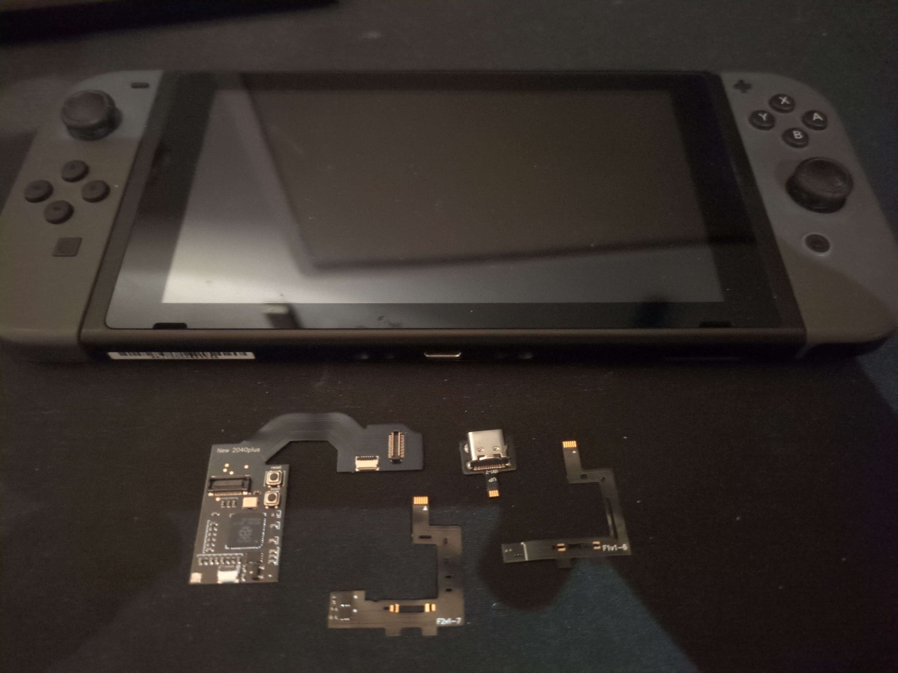
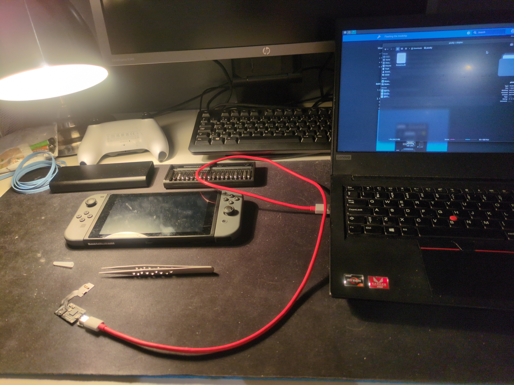
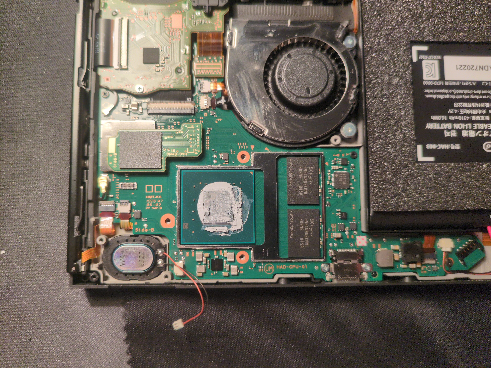
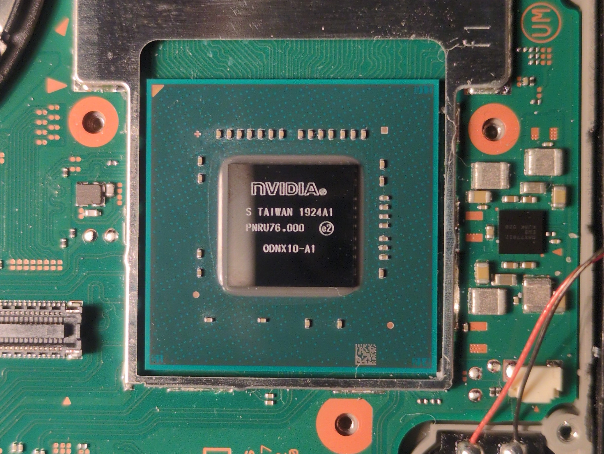
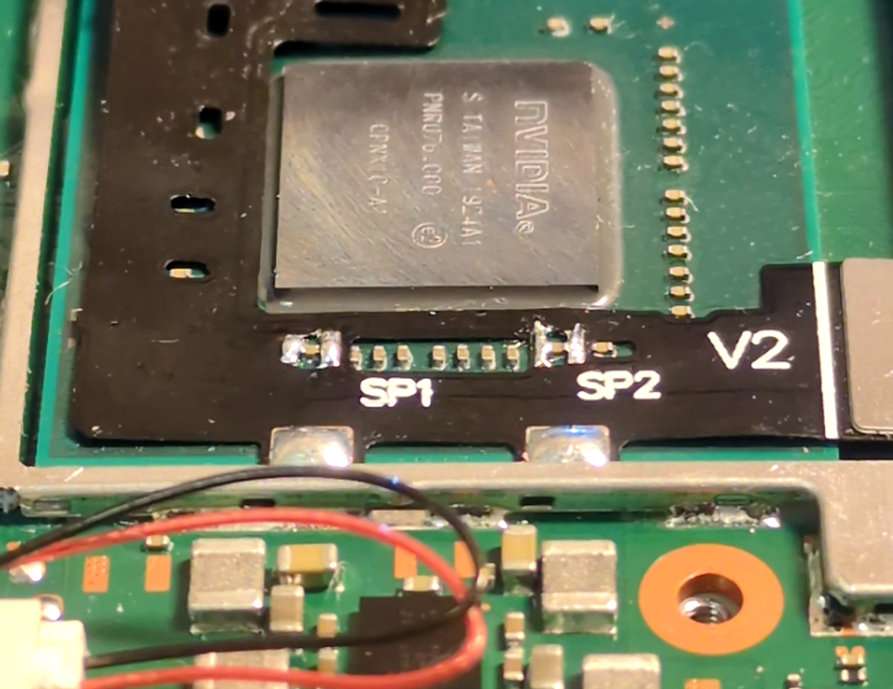
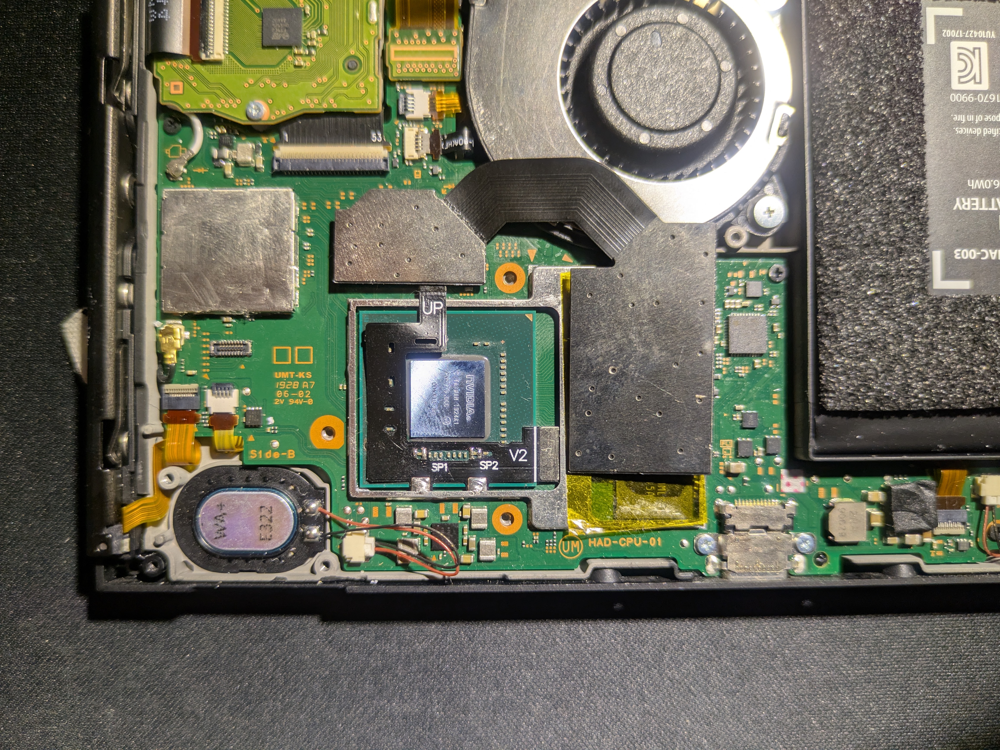
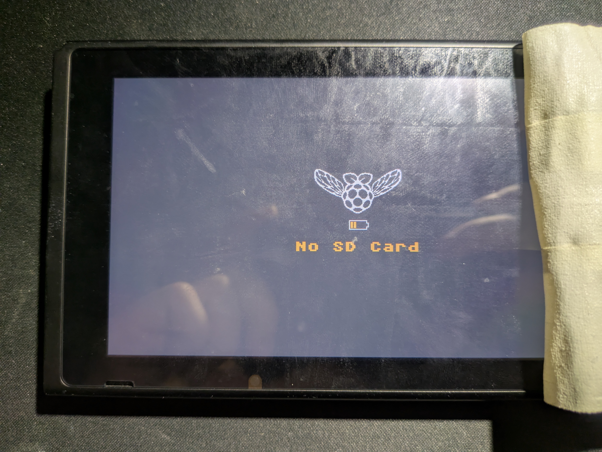
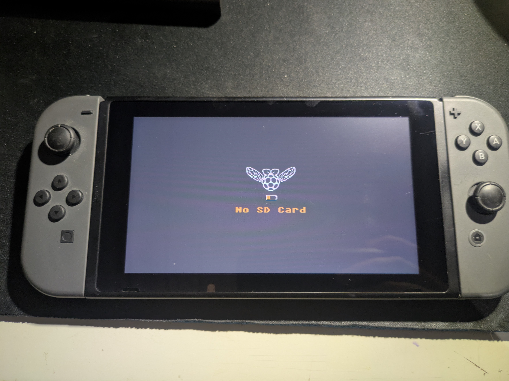
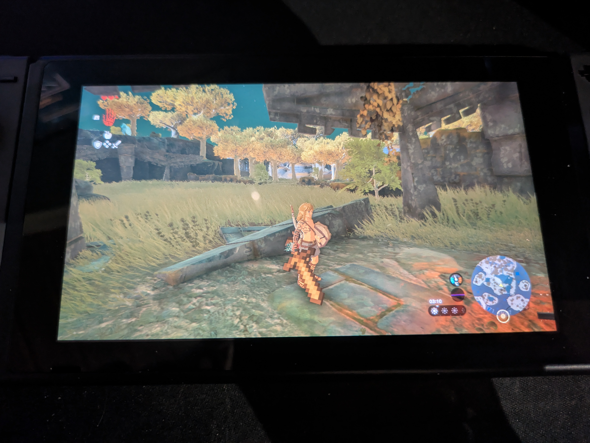

Modding your Nintendo Switch unlocks many capabilities, it previously did not have. Including overclocking, backing up your game saves, installing custom menu themes, running your own custom apps, aka. Homebrew apps and custom firmware. This guide is for people who have a patched version of the Switch, since the opposite does not require the installation of a chip. I must note that this process requires some microsoldering skills, and will most certainly void your warranty, if that's something you care about. I do not hold responsibility for any damage caused from following this guide. Everything here is done at your own risk. 

## Identifying your model

Currently, there are two hardware revisions of the Switch. Any Switch that was manufactured before the middle of 2018 (HAC-001) with the Tegra X1 SoC has a bug in its boot ROM that enables running custom code regardless of the firmware version installed. Thus, Nintendo cannot patch it remotely. After that point, Nintendo started to push out a new iteration of the console with a patched boot ROM with the same model number. A software exploit may be found for these patched Switches in the far future, if the firmware is kept below 7.0.1. I wouldn't have time to bet on that.

In July 2019 Nintendo announced two updated consoles: the Switch Lite (HDH-001) and a new model of the original Switch (HAC-001(-01)/“V2”) with better battery life. Both models have the upgraded Tegra X1+ SoC and a completely new boot ROM, which can only be hacked with a modchip. There's also an OLED version (HEG-001), which came out in 2021. I have the V2, which I'll be modding. To identify your Switch, you can follow the NH Switch Guide.

> [!NOTE]
The Nintendo Switch 2, released on June 5, 2025, is ignored here. Some user land exploits have [already been demonstrated](https://www.tomshardware.com/video-games/handheld-gaming/hackers-discover-nintendo-switch-2-exploit-one-day-after-launch-minor-hack-allows-running-custom-code-on-top-of-os), but it's not enough to gain privileged access to the device. No hardware hacks have been discovered either.

## Obtain the modchip

The modchip that I'll be installing is the Picofly, which comes in different variants based on the Switch model. Core for the normal Switch, Lite for the Lite Switch, and OLED for the OLED. All are based on the RP2040 microcontroller. You may also use RP2040 development boards like the RP2040-Zero, but the installation is way more involved. The modchips are most commonly found on AliExpress.

One may often come across the terms “Hwfly” or “SX Clone” in listings, which refer to the SX Core and SX Lite modchips originally designed and produced by Team Xecuter, until they were arrested. They are partly the reason for the muddy reputation of Switch modchips. These chips that you find nowadays are clones of the originals and use closed source microcontrollers, board designs, and ofter poor quality components. These chips are not related to the Picofly.

## Installation 

### Test the modchip

Before all else, you should test that the modchip works by connecting the modchip via the USB debug port. The Picofly should come with the firmware pre-flashed onto the controller, but since the firmware is actively maintained by Rehius on GPAtemp, it's not a bad idea to make sure the firmware is up to date. Holding down the boot button while simultaneously plugging in the USB cable will present the modchip as a disk on your computer. Just drag and drop in the firmware.uf2 file, and it will automatically eject itself.

### Open up the switch

I'm not going to show the detailed steps on how to tear down the Switch. You can, however, find those steps on the guides from iFixit, for example. You should take apart the Switch, until you get to the bare SoC. Before you do that, it's a good idea to cover the screen with something like tape to prevent scratches when you're working on it. Remember to unplug the battery, once you get to that step. I also disconnected the speaker near the SoC, because its cable was in the way a little. Clean up all the solder paste in preparation for soldering. I first wiped off the bulk with paper, then with a Q-tip and isopropyl alcohol, and lastly with a toothbrush to get the paste between the capacitors on the SoC die.

### Solder on the ribbon cable

The Picofly Core kit comes with ribbon cables for the V1 and V2 version of the Switch, respectively. The difference between them is the orientation of the capacitors to be soldered to the pads on the cable. Apply flux and pre-tin the pads labeled `SP1` and `SP2` on the ribbon cable. I didn't have extra flux at the time of soldering, but I tried anyway. Long story short, the experience was so terrible that I stopped to order some before continuing. I used lead-free solder with a flux core, but the flux would evaporate before I got to do the actual soldering of the capacitors. 

After you have tinned the pads on the cable, place it, so that the pads align with the first capacitor from the left and the second last to the right. Make sure the two anker pads and the large pad of the MOSFET section of the cable are under the metal frame around the SoC.  Apply more flux to the pads, and while holding down the cable with something like a pair of tweezers, carefully solder the two pairs of pads to the ends of the capacitors. You should be constantly cleaning your iron during the process. Lastly, solder the two anker points to the frame. Using Q-tips, a toothbrush, and isopropyl alcohol, remove the remaining flux to prevent corrosion.

### Connect the modchip and eMMC module

Remove the eMMC module from the FPC connector on the motherboard, then connect it to the FPC interface on the modchip. Take something non-conductive like Kapton tape and put it between the modchip and the RAM modules on the right of the SoC. Attach the connector labeled UP on the cable to the modchip and connect the modchip to the motherboard onto the FPC connector where the eMMC module originally was. You can now connect the battery cable and turn on the console to test if it works. When powering on the console, the modchip will start to glitch the CPU, and eventually the screen will display a splash screen: “No SD Card”.

### Reassemble the console

You can now start putting the Switch back together. After you have tested that your installation works in the previous step, you can remove the Kapton tape on top of the RAM modules. Apply new thermal paste on to the SoC. You need to fold one of the edges of the IHS flat to allow room for the ribbon cable. After putting the IHS back on, put on some Kapton tape between the modchip and the IHS to prevent shorts. As you assemble, apply more thermal paste if needed or replace it completely. Once you get to putting the metal backplate on, you need to cut out a piece from it, because otherwise the modchip doesn't have enough clearance. A pair of scissors works just fine.

## Conclusion

That's all you need to do to unlock a patched Nintendo Switch. At least that was the hard part. Next up, you would download a bootloader like Hekate on to a SD card, which allows you to easily load custom firmware like Atmosphère, or even Android and Linux for whatever reason. Hekate has many other features as well, such as, backing up your sysMMC, formatting a SD card and setting up emuMMC, and viewing hardware information. If you have any questions, suggestions or feedback, feel free to comment below. As always, thanks for taking your time reading my blog!

