In this blog, I'm going to show you how to turn nearly any dusty old computer into a multi-terabyte NAS and media server.  No more storing your most important data on failing external hard drives or multiple free cloud storage accounts. All it takes is a reasonable one time investment, and then it's only running on power. I'll go from putting together the physical server to installing and deploying [TrueNAS Community Edition](https://www.truenas.com/docs/softwarestatus/) on it.

## The data problem

For a long time, I've been thinking about how I'm going to safely store and organize the massive amounts of data that I own. From family photos scattered across multiple scratched up CDs to the hundreds of gigabytes of pictures that I've taken over the years stored on my main computer. The data is irreplaceable and yet, it's hanging on by a thread. 

I could throw it all into the cloud, but then again, the space offered by free plans is limited. Creating multiple free accounts for this is not only against the TOS of service providers, but also extremely clunky and unmanageable. Paying isn't an option either because the last thing I need as a student is another subscription. And what if for some unforeseen reason I lose access to that paid account, the company goes out of business, or gets breached.

## Hosting it yourself

With the options discussed above out of the window, the only option left seems to be hosting the infrastructure yourself. Not that hosting the server yourself removes the risk of a cataclysmic event where your server either catches fire or gets hacked. I'm, however, going to show you how to reduce that risk. Considering that I'm a want to be engineer (student), it's only canon to end up at this conclusion. 

I didn't want to just barge to buy any pre-built NAS. Even though they offer an out-of-the-box experience, the fun ends there. The replacement parts are often proprietary and expensive, support is spotty, customization is limited, and most importantly it's too simple. Which, of course, is no fun. Therefore, I must build and host it myself.

I wanted to make the most optimal purchasing decision for the parts for this project, like any self-respecting engineer would. Since I was going to be hosting this myself, I had to plan this through somehow. So for a while I crunched on the options for my semi-final storage solution and came up with this **list of requirements:**

- **Serviceability:** replacement parts are readily available.
- **Flexibility:** system components can be substituted according to what is available at hand.
- **Expandability**: the scope of the server can be expanded to serve other functions to not waste computing resources.
- **Reliability:** I can trust that the server will work as expected, and in the event of failure, it can be fixed without data loss.
- **Adaptability:** the system is general-purpose and can be equipped with a multitude of different operating systems, making it independent of any specific software stack.
- **Supportability:** the software installed is well-supported, sustainable, and offers modern features.
## Building the server

### The old PC

 I just so happened to remember that I had an old gaming PC motherboard and case lying around. The case, a Fractal Design Core 2500, was in my garage, missing all its legs, 3 PCIe I/O-shields, and one hard drive bay.  The motherboard was an Asus Z97-E with an Intel Core i5-4690K along with its I/O-shield also missing.  Instead of buying a new motherboard and case for this project, I wanted to be resourceful and thus, that's what I went with.

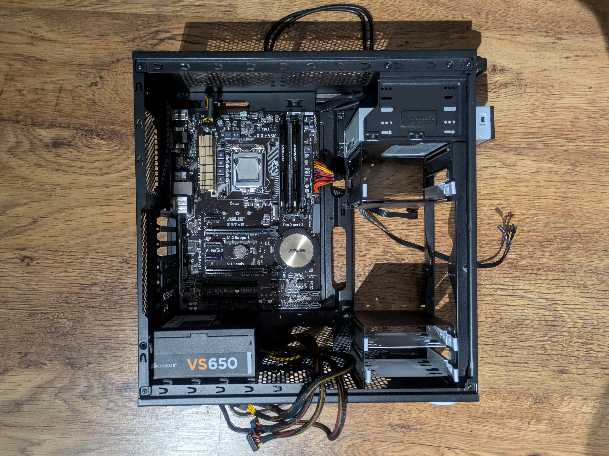

The motherboard and the CPU certainly aren't the latest and greatest in terms of performance and power efficiency. They, however, have all the features I need for my server, and I don't see a reason to throw away perfectly good hardware. Notably, the motherboard has a total of 6 SATA ports. 2 of which share the same PCIe bandwidth with a SATA Express port and an M.2 socket. I'm going to be using the M.2 socket for my TrueNAS boot drive.

### Getting the missing parts

From AliExpress, I bought some makeshift rubber feet meant for furniture and screwed them on the bottom of the case. I also ordered a NVMe PCIe expansion card, I/O-shields for the PCIe slots and one for the motherboard. I had the original front intake fans for the case lying around, so I threw those in the mix as well. Then I got an extra 500 GB NVMe drive from a friend for a considerable discount. He also knew a guy who runs a computer repair business from his garage. From him, I got a used CPU cooler and the missing hard drive bay. That guy also tried to run a NAS once. It was a pre-built made by QNAP if I remember correctly. Anyway, it was compromised by Turkish hackers and his data held for ransom due to a zero-day. Tough luck, I guess.

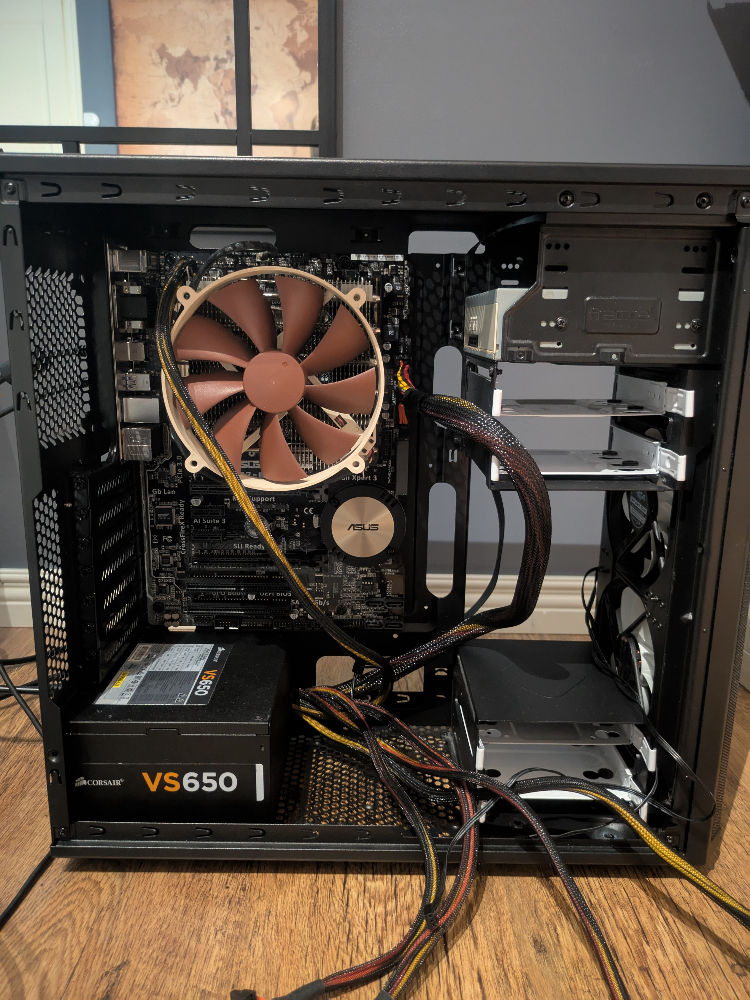


	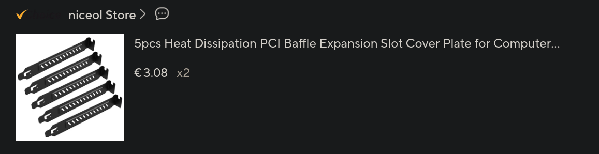
	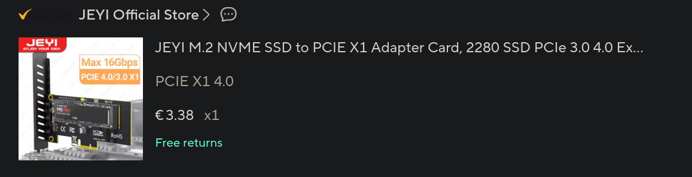
	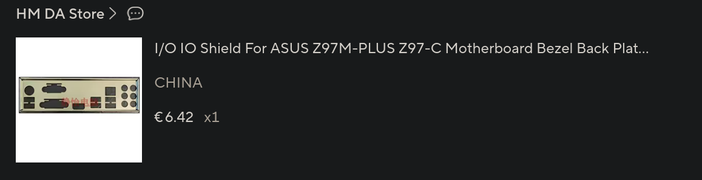
	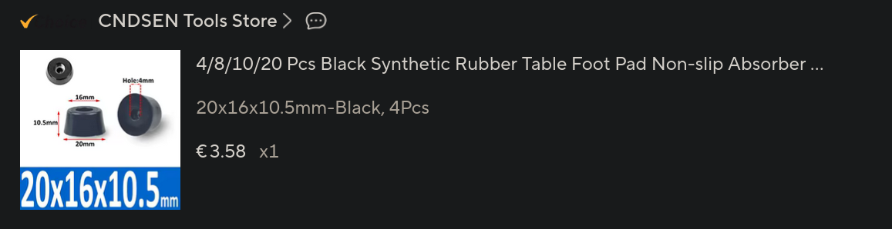


### Considering the PSU

Since this is going to be a server, which I'm going to trust with all of my data, it needs to be reasonably reliable (coming back to my requirements). I was, however, a little suspicious of my Corsair VS650 PSU, which must be at least 10 years old now. The fan was making a loud screeching noise, but I was still able to use it to test the functionality of my motherboard, RAM and SSDs. Taking apart the PSU and inspecting the fan bearing, I found that there was a massive groove that had been gouged into the inner fan housing due to the parts rubbing together. The rotor shaft was also bone dry. I wasn't going to salvage it, so I just threw it away.

The server is going to be in my bedroom, so it also has to be relatively quiet. If I were to only replace the fan, then I'd need to get a fan with the same features. Since the original fan header only had a wire for 12V input and ground, I'd also need to retrofit the correct header for the new fan. You just can't find fans with that kind of header by default, and even if I happened to find the OEM fan for this PSU, the price wouldn't make up for it. For such an effort and investment, only to still end up with the same mediocre PSU, I was better off getting a new more reliable and efficient one.

An excellent resource for comparing different PSUs is the [Cybenetics PSU performance database.](https://www.cybenetics.com/index.php?option=psu-performance-database) Another is Gamers Nexus on YouTube for general information about PSUs. I went with the modular Be Quiet! Pure Power 13 M 550 W. I found that to be a good compromise of price, performance, and efficiency for my purpose. The power is pretty low, but I'm unlikely to need more than that, since the server has a relatively low power consumption anyway.
### Choosing the hard drives

For the hard drives, I went with 4x Seagate IronWolf 4 TB drives (ST4000VN006). I went slightly overkill with the size, but I can use the extra space for redundancy. I configured the drives with raid 10, which means that there are two mirror pairs, with the data striped across the two mirrors. This leaves me with 8 TB of raw usable space. I'll explain more about this in the TrueNAS installation steps. First, I must attach the hard drives to the drive bays. Then rubber rings in between to attenuate the vibrations. I also put on some labels, so I know to put them back in if I take them out at any point.

.*")

.*")

### Final assembly

After installing the new PSU, hard drives and managing the cables, the final assembly of the server is finished.  The hard drives are connected to the SATA ports in the bottom right corner of the motherboard. On the motherboard, I have a 128 GB NVMe drive, which I pulled out of an unused laptop.  I'll use that as the boot drive for the installation. The expansion card has the 500 GB drive that I'ill use to store app configuration data. A little oversized for its purpose, but it's what I had. 

The general recommendation by TrueNAS is to have redundancy for your boot drives. This enables TrueNAS to boot even if the other one of the redundant drives fails unexpectedly. I, however, don't need that kind of availability. The most important thing for me is that the hard drives used for storing the actual data have redundancy and that the configuration is occasionally backed up.

The two front intake fans have a mesh air filter in front of them, which limits dust and cools the drives conveniently. They produce a net positive static pressure inside the case, which should ideally limit the air from flowing in through unfiltered gaps. I removed the USB cable and HD audio cables from the case, because they're redundant for the server and take up space.

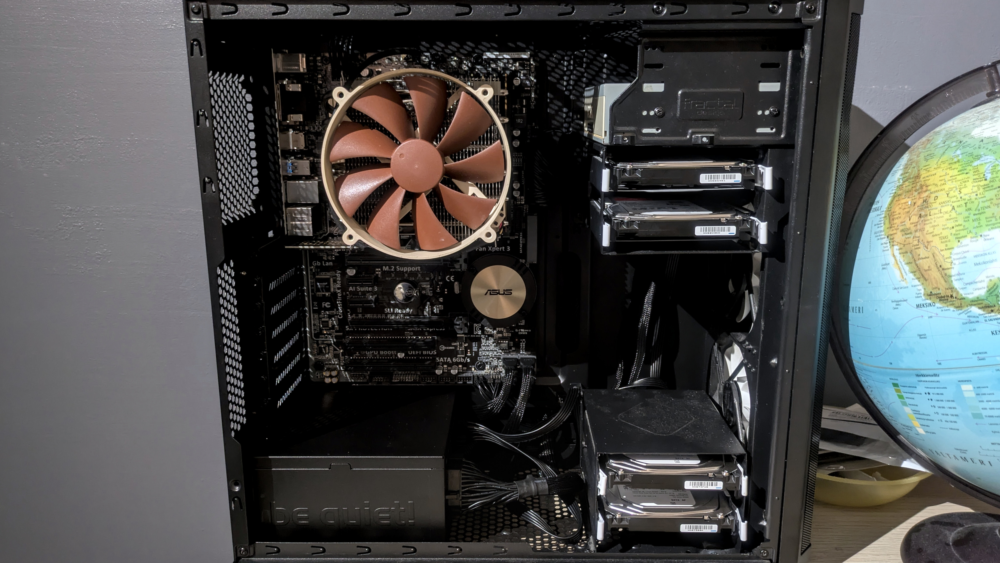

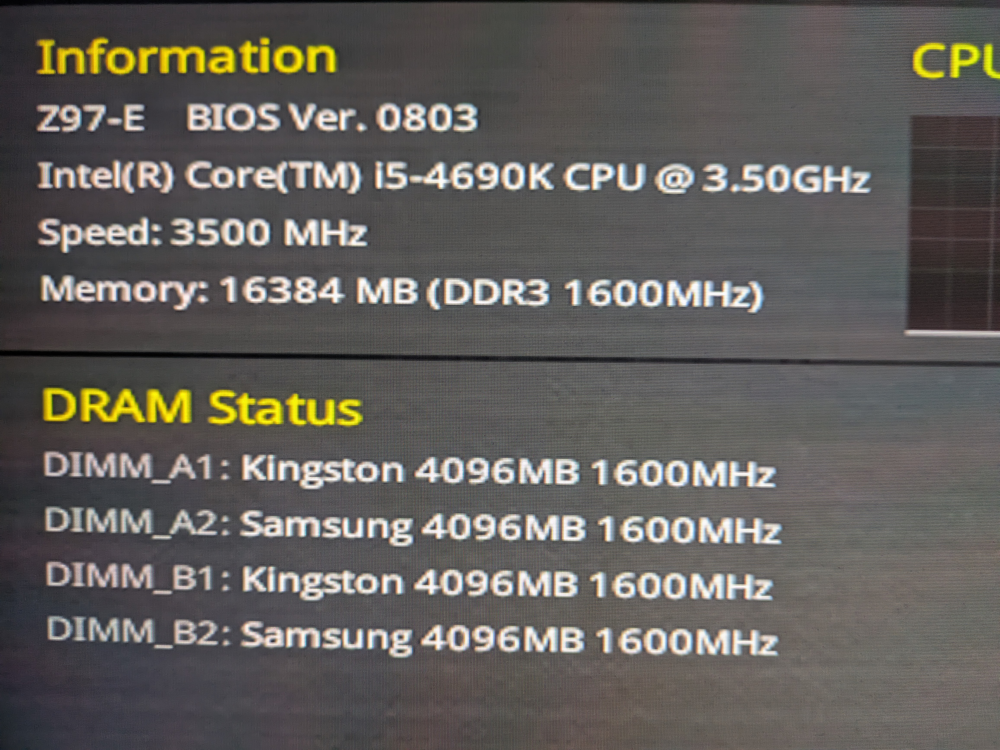
## Installing TrueNAS Community Edition

### Installing 

For this server, I'm going to be installing TrueNAS Community Edition. It was previously known as an umbrella term to describe the Linux branch of TrueNAS (SCALE) and the FreeBSD branch (CORE). Since April 15, 2025, [SCALE was merged](https://www.truenas.com/blog/truenas-community-edition-release-2504/) as part of TrueNAS Community Edition, and CORE eventually entered its maintenance phase. So by Community Edition I mean the linux version of TrueNAS.

If you plan on building your own TrueNAS server, you should read the TrueNAS [hardware guide](https://www.truenas.com/docs/scale/gettingstarted/scalehardwareguide/), which tells you everything you need to know in terms of choosing the components. After that, you can pick based on your requirements whether you want the latest version with the latest features or an older release if you prefer stability. I went with the version 25.04, aka Fangtooth. TrueNAS has the all the details for this on their [documentation hub](https://www.truenas.com/docs/). 

To install TrueNAS, you need to flash the installation ISO to a USB stick like usual. Turning your server on with a monitor and keyboard connected, select to boot from a USB stick or any other media you've chosen.  Remember to turn off secure boot because otherwise the installer will not boot. I won't go through the installation process here, since there is no reason to duplicate the [original instructions.](https://www.truenas.com/docs/scale/25.04/gettingstarted/install/installingscale/) TrueNAS provides an easy to follow interactive installer with the installation media. 

TrueNAS provides the feature to install apps, which are applications running in docker containers. These include, for example, a VPN for remote management, a media server, or an ad blocking DNS server like Pi-Hole. The data for these apps, however, can't be stored on the boot drive, i.e., you can't create different partitions on the boot drive for TrueNAS itself and app data separately. TrueNAS doesn't support it.

### Configuring

After TrueNAS has been installed, a DHCP server will automatically start on boot. You can thus plug the server into your local network and access it via the web UI. When entering the web UI, you can log in with the default administrator account if you set that up during the installation. It's recommended to create a new administrator account with a unique name, password, and disable password login for the others (`truenas_admin` and `root`).

You can then get to know the interface. Check out the different tabs and settings menus. Install the latest minor version, timezones, set the appearance of the dashboard and the theme, etc. It's recommended to configure a static IP-address for your server, so that it doesn't change unexpectedly. You can also configure alerts for your system, so you get notified if something happens. I went with Gmail, but there are many other options available.

### Pools and Vdevs

To start using my TrueNAS server, I created one ZFS pool for app data on my 500 GB SSD called **fast-pool** and another pool for my 4 HDDs with 2 mirrored vdevs of 2 disks called **jumbo-pool**. Freedom to use your preferred naming convention here, but I went with something simple and concise. The data pool has no redundancy here, but I can always occasionally replicate a snapshot of the drive to my larger storage pool. Here are the two storage pools.

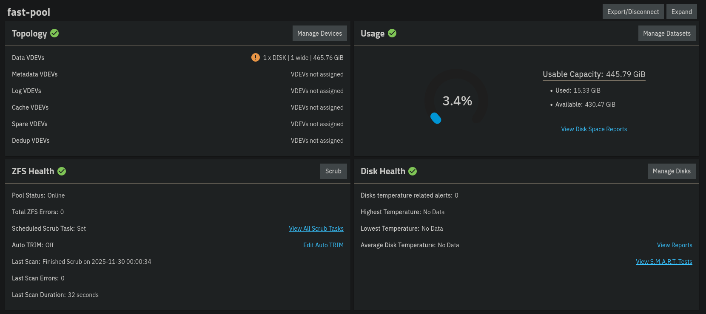

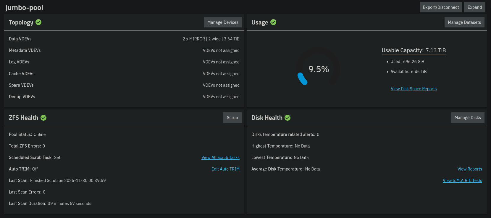

Despite the penalty in the usable space, it offers some advantages over a 4 disk setup with RAIDZ1, which is basically the ZFS equivalent of RAID 5. Notably, the faster read speed and IOPS. It can also lose up to 2 disks at the same time, although, I doubt I'll be needing that. If you want to learn more about the advantages of different configurations, you can check out this [white paper by TrueNAS.](https://www.truenas.com/wp-content/uploads/2023/11/ZFS_Storage_Pool_Layout_White_Paper_November_2023.pdf)
### Datasets

After setting up your storage pools, you can make datasets or zvols on them. Every pool has a root dataset by default that you can further divide up into smaller non-root parent datasets and child datasets. A dataset is essentially a filesystem for which you can configure specific permissions. A zvol is a virtual block device, which has a predefined size. Zvols are mainly used with the iSCSI sharing protocol, and for virtual machine storage needs. I created and categorized some datasets based on the different types of data that I have. The home (koti) dataset stores my family pictures and files. Devices (laitteet) has child datasets for files that are specific to all my devices, including a child dataset for files share across devices. A media dataset for storing movies, books, and music. And lastly, a dataset that has a child dataset for each family member's personal cloud storage.

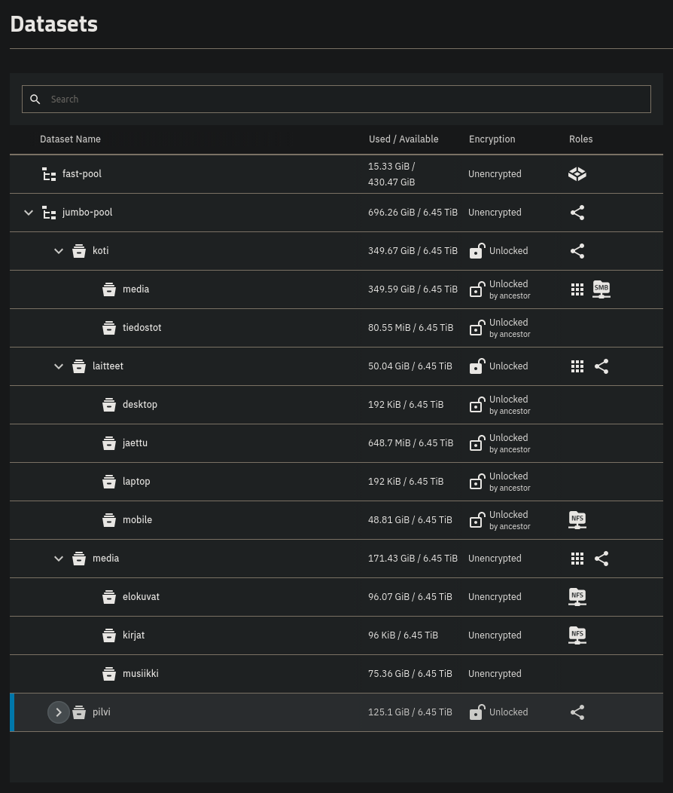

## Risk assessment

This may be a little out of scope for this blog, but I think it's a good idea to go through the risks of this deployment. This is something we all should think about when self-hosting anything that is of importance to you or others. Naturally, you take responsibility of maintaining the hardware and software that comprise the system. If you used reliable hardware and did a proper initial configuration, it's relatively safe for a set it and forget it type of setup. I've been running my server for about two months now and haven't had any issues. Regardless, it's smart to go through the things that could go wrong, and analyze if there's a reasonable way to mitigate the risk. It's important to remember that there exists no absolute security. We can only mitigate risk to a point where it's acceptable. This is also by no means an exhaustive list, rather some of the things that came to my mind.

### Environmental risks

- **Is the air really humid, hot, or dusty:** these are factors that may decrease the life expectancy of your components. Try finding the most climate controlled room for your server, taking into account how you're going to wire it for networking.
- **Where is the server placed:** is it on the floor or high up, and can it easily fall off if tripped on? Put it in a place where it cannot be accidentally knocked over, and tuck the cables away so no one trips on them.
- **Do you live in a place with frequent thunderstorms or blackouts:** these can cause unexpected shutdowns or even damage your components if proper surge protection isn't present. It's not a bad idea to invest in a UPS or have whole-building surge protection, which is designed to counter surge currents from lightning strikes. The surge protection in a power cord or a small desktop UPS is probably not going to save you from direct strikes.
- **Do other people have access to the room where the server resides:** do the people with access to the room know of the server's importance? Can they accidentally shut down or damage the server? Maybe put a do not touch sign on the case or some other warning.
- **Do you have an offsite backup:** what if your house gets robbed, burned down, the server gets smashed or enough drives fail at the same time? The server represents a single point of failure. TrueNAS supports setting up replication to another remote TrueNAS server. If that's too much investment, then storing an off site backup of your most important data offline on a hard drive already reduces the risk quite a lot. Besides, having the disk offline air gaps it from a ransomware attack to your NAS. 

### Cyber risks

- **Do you trust the network or subnet, which the server is a part of:** does the server share a subnet with untrusted devices, which have a high possibility of being compromised, and being used to gain lateral movement in your network? If applicable, configure your server to be in a different isolated VLAN.
- **Is the software up to date and passwords secure:** not always a problem, unless the server is exposed to the internet, or the above is true. Still a good habit to update TrueNAS and all the apps you're running regularly, and not use the most popular passwords.
- **Is confidential data encrypted:** if you're concerned about the possibility of theft, then you should enable data-at-rest encryption on the datasets that you deem important. You can enable encryption with a password or key on a ZFS pool or per dataset/child dataset. Take care to store the passphrase or key in a safe place, as this represents a new risk for complete data loss.
- **Are permissions configured correctly:** do only the people you intend to have access to resources have access, and no one else. Have you disabled login for the default administrator accounts? When creating new network shares, it's best practice to dedicate a separate account for each share or group of similar shares.

## Conclusion

Overall, this was one of the best things I've built for myself. It has massively helped me organize and manage my data, and has given me the ability to access it from anywhere using Tailscale VPN. With the help of redundancy from ZFS RAID, I can lose up to 2 disks at the same time (one from both vdevs), and still retain all my data. At the same time, I can get notifications about the state of my drives through TrueNAS. This is in contrast to storing your data cold on an external hard drive, which you can't actively monitor.

In future blogs, I'll be showcasing how to set up a Jellyfin media server on it for streaming your favorite movies, shows, music, and family photos, FreshRSS news aggregator for accessing all your news and other media like YouTube videos from one place, Tailscale for remote management and resource access, and Syncthing for syncing your files across devices. A future improvement for this build would be adding a UPS, since I live in a place where power delivery can be spotty at times.
