In this blog, I am building a completely wireless custom 42-key split keyboard. The PCB for this build, designed by [Splitkb.com](https://splitkb.com), is a derivative of the [original Corne](https://github.com/foostan/crkbd) design by Foostan. I am not affiliated with Splitkb.com, but they are among the good few in the EU that sell pre-made PCBs, switches, keycaps, and other parts for custom keyboards. What makes it wireless is the pair of [nice!nano](https://nicekeyboards.com/nice-nano/) microcontrollers along with the ZMK firmware.

Custom keyboards tend to be on the more expensive side, but you can of course leave out the parts that aren't absolutely necessary for the function of the keyboard, such as the acrylic plates, displays, or tenting legs. You can also cut costs by going the full DIY route of 3D printing the parts yourself and getting the PCB printed by a manufacturer like [PCBWay](https://pcbway.com). If you decide to go that route, consider creating your own design if you have the time and patience. This opens up the opportunity to design it precisely for your needs on top of teaching you a thing or two about PCB design!

## Why the split

### The issue with modern keyboards

Admittedly, the split keyboard has a bit of a niche market, especially compared to the ubiquitous QWERTY keyboard that comes in ISO and ANSI variants. A third, less common standard is JIS, which is used primarily in Japan. One reason for its popularity is its long history and wide adoption, stemming from the age of the typewriter. Despite its downsides, the layout along with the arrangement of keys is still the most popular in today's keyboards. Notably, the horizontal staggering of the keys is a feature to prevent the typebars of typewriters from jamming when multiple keys are pressed at the same time. This, however, presents no mechanical or ergonomic advantage in modern keyboards.

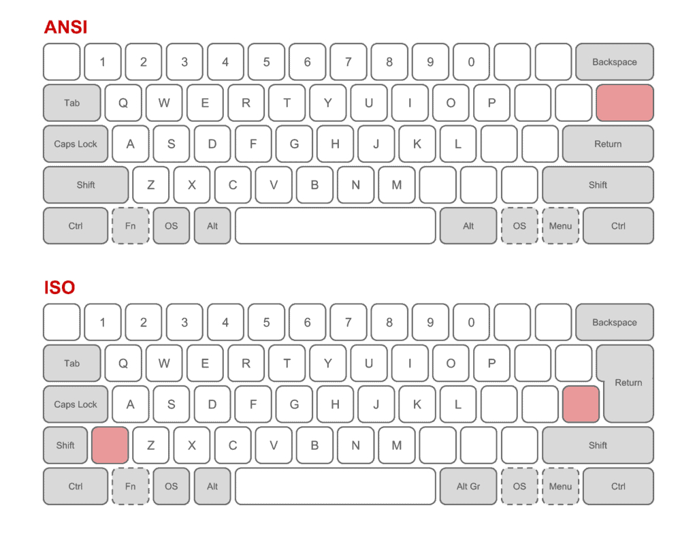

Another drawback of this physical layout is that the keys are all in a single compact cluster. This can be inflexible for people with varying shoulder widths. When we rest our hands on the keyboard in a touch-typing position, our wrists are often parallel to the keys of the home row. If your shoulders are any wider than the home row, then your wrists will be in ulnar deviation. I myself have adjusted for this by resting my hands on the keyboard at a slight angle and curling my fingers appropriately, so that there is no deviation in my wrists.

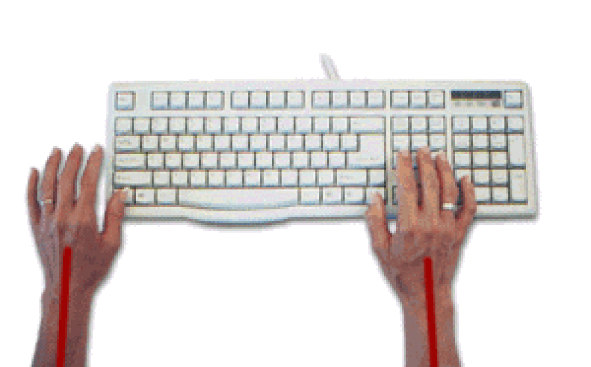

The last notable problem is the unbalanced stress on each finger of the hand. When touch typing, there is a major difference in the number of keys assigned to each finger and the distance needed to reach them. Especially the pinky fingers have a lot more keys to press and reach compared to the middle fingers for example. This can be seen in common touch-typing diagrams. The extra distance that the pinky fingers need to move in order to reach the furthest keys often results in the hands drifting away from the home row and having to readjust afterwards.

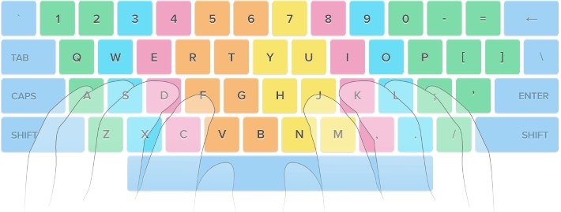

### What does the split keyboard fix

The keyboard that I built fixes the majority of these issues, introducing a full split design, and allowing for liberal placement of the two halves of the keyboard. It removes the row staggering and instead replaces it with column staggering in order to mimic the natural shape of the human hand. It almost entirely fixes the finger inequality issue. Each finger has only three keys to press, except for the pinky and index fingers, which both have six. The thumb is also heavily used for the modifier keys required to switch between layers to access more keys. Despite this, when resting the hands on the home row, each key is only one key's distance away. There is an even smaller design called the [Sweep](https://github.com/davidphilipbarr/Sweep), which shaves off a column from each half and one key from each thumb cluster. The one I am building is thus a compromise between ergonomics and the number of keys for accessibility.

## The build

Now I am going to start building the actual keyboard. This is not really a tutorial per se, but serves as a demonstration that different kinds of keyboards exist, and how they are built. I will 
thus be skipping over the steps a bit as I build. The comprehensive build guide for this keyboard can be found on [Splitkb.com's wiki](https://docs.splitkb.com/product-guides/aurora-series/build-guide).

### Assortment of parts

For the build, I used the following parts that I ordered from Splitkb.com. Starting from the top-left of the image:

- 2x Acrylic bottom plates
- 2x nice!nano microcontrollers and Mill-Max low profile sockets
- Wireless controller expansion bundle (switches and buttons for wireless functionality), standoffs, and screws for the bottom plates
- 2x FR4 top plates
- Aurora Corne PCB kit
- 42x MBK PBT keycaps
- 42x Kailh low-profile Burnt Orange switches
- 2x 110 mAh 3.3 V batteries (not in the image; bought separately due to regulatory issues)

.*")

### Equipment

Here's some of the equipment that I used for this build. Most importantly, a soldering iron (preferably adjustable), which I bought off AliExpress. A pair of magnifying glasses, even though I don't really need them, since I can see up close quite well. Some 0.5 mm soldering wire with a flux core. You can go with leaded or lead-free solder. Leaded solder is generally easier to work with due to the lower melting point and flow characteristics. Lastly, while not shown here, it is going to make your life significantly easier to use extra flux while soldering.  

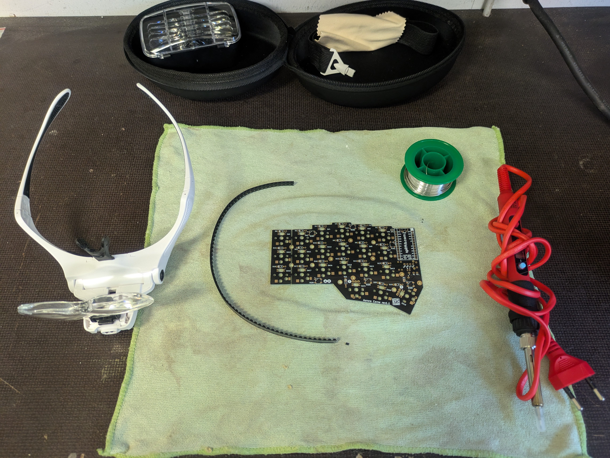

### Diodes

I first soldered the SMD diodes onto the PCB. There are two small pads for each diode. I first applied a small amount of solder for each pair of pads. I then moved a diode over a pad with a pair of tweezers, soldered one connection by reflowing the previously applied solder, and then the other connection. I repeated this for each diode for both halves of the keyboard. I also applied some solder to the switch socket pads in this step. The diodes are quite small, so I took my time here. They also need to be in the correct orientation.

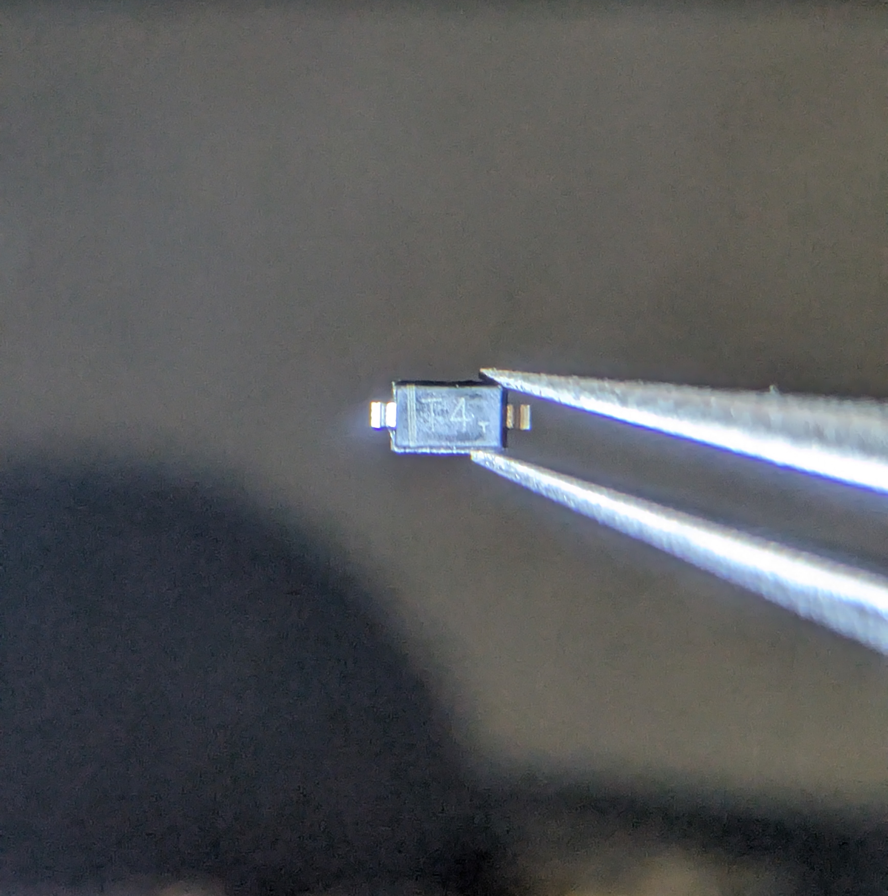
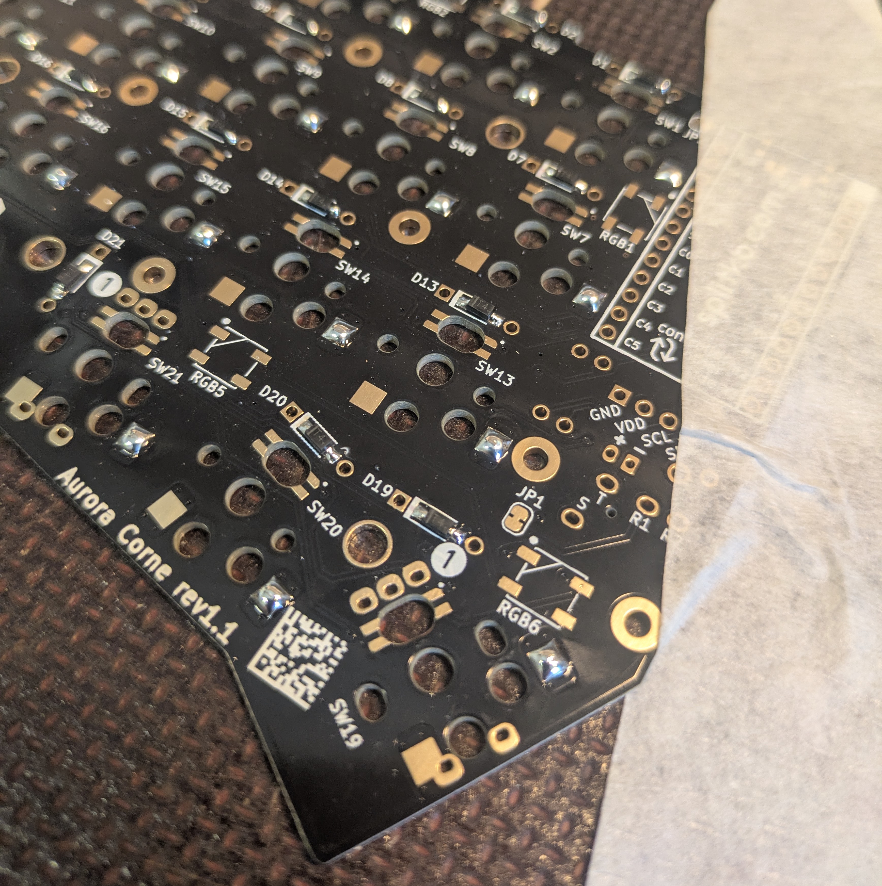

### Hot-swap switch sockets

I then soldered on the hot-swap switch sockets that allow for hot-swapping the board with different low-profile switches if I ever want to try out different ones. I will follow the same procedure for the sockets as I did on the diodes. Only now the pads are larger and easier to work with. 

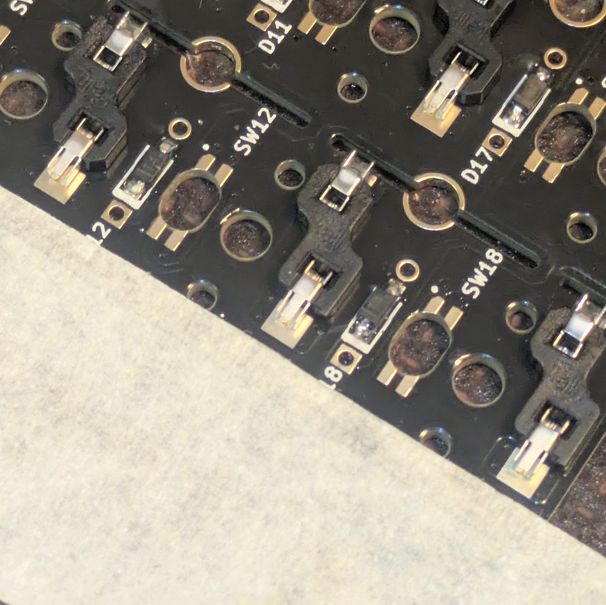

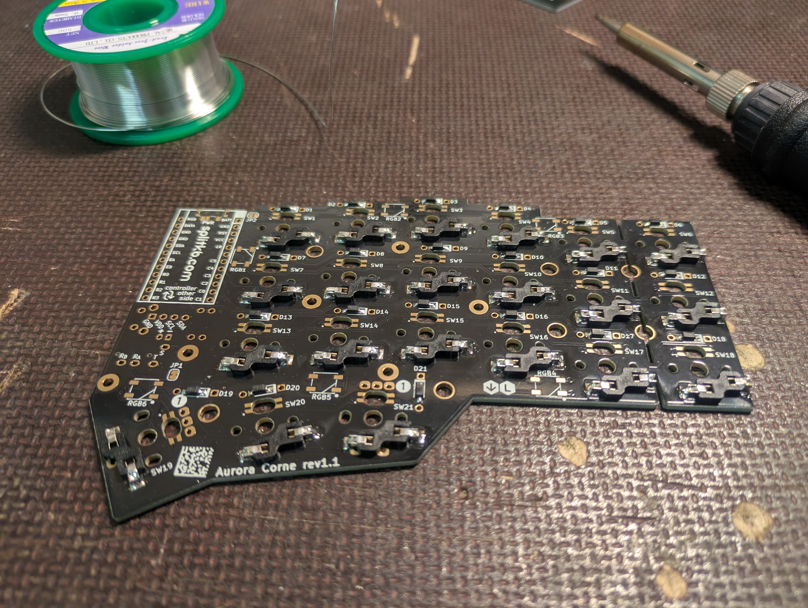

### Resistors and reset button

Next I soldered on the resistors R1 and R2. I also soldered on the reset button in this step. This lets you to enter bootloader mode by quickly pressing the button twice in succession, allowing you to flash the firmware again. If you press it once, you can reset the controller's connection. This is handy if you are experiencing connection issues.

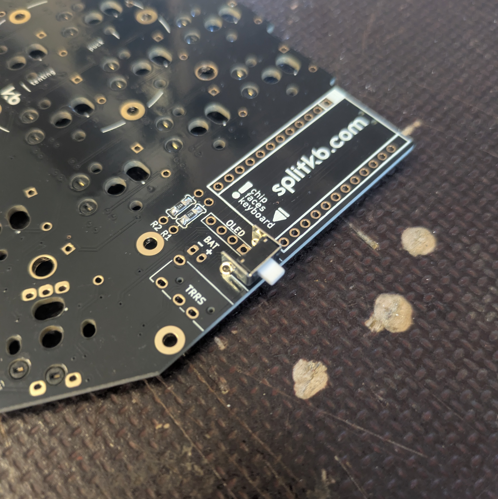

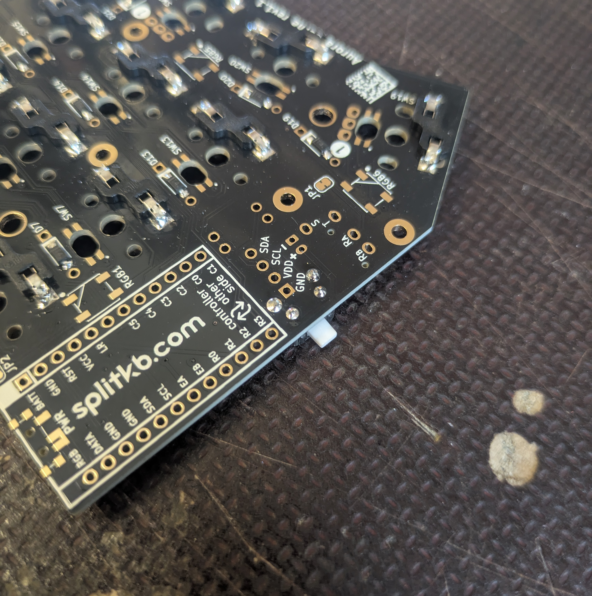

### Power switch

Next, the power switch. This is useful for preserving battery life when not using the keyboard, as it cuts power from the battery to the microcontroller. While the power-saving mode of the nice!nano is pretty efficient, it certainly doesn't hurt to have one on. Besides, the circuit is open as is, so it needs something to bridge the gap. I first applied a bit of solder to one pad, attached the switch, and soldered the rest.

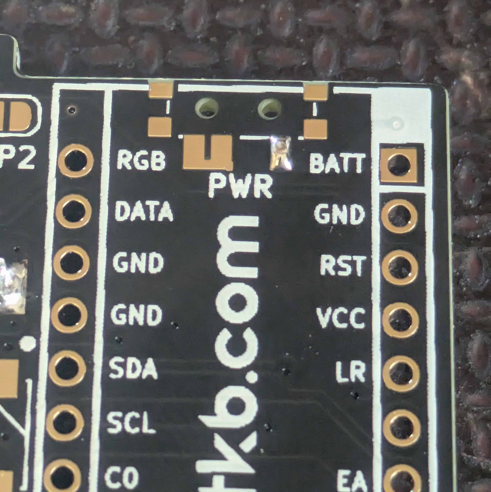

### Mill-Max sockets

The sockets allow for easy relocation of the microcontroller if you ever need to replace it or move it to some other keyboard. I put on some Kapton tape to hold the sockets in place as I soldered them. It's very important to get them straight, otherwise the microcontroller won't fit into the sockets, meaning you'll likely have to resolder the sockets.

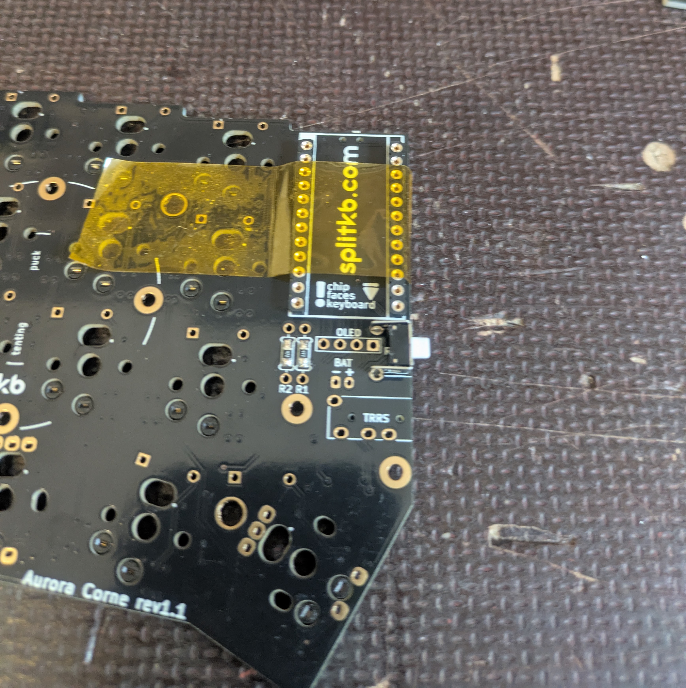

### Batteries and nice!nanos

I first tried to attach the battery by soldering JST jacks onto the PCB and attaching male connectors onto the battery wires. I later realized that this would not fit with the final assembly, so I desoldered the jacks and soldered the battery directly onto the PCB. I also soldered the male Mill-Max socket headers onto the nice!nanos in this step. Before doing that, it is a good idea to test the microcontrollers by flashing the default firmware to them. If that doesn't yield any errors then it is relatively safe to assume that the controllers work.

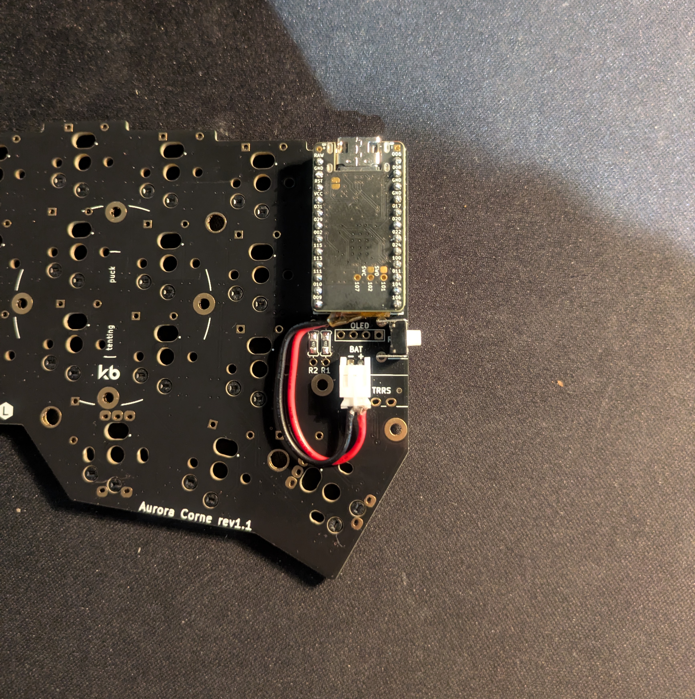

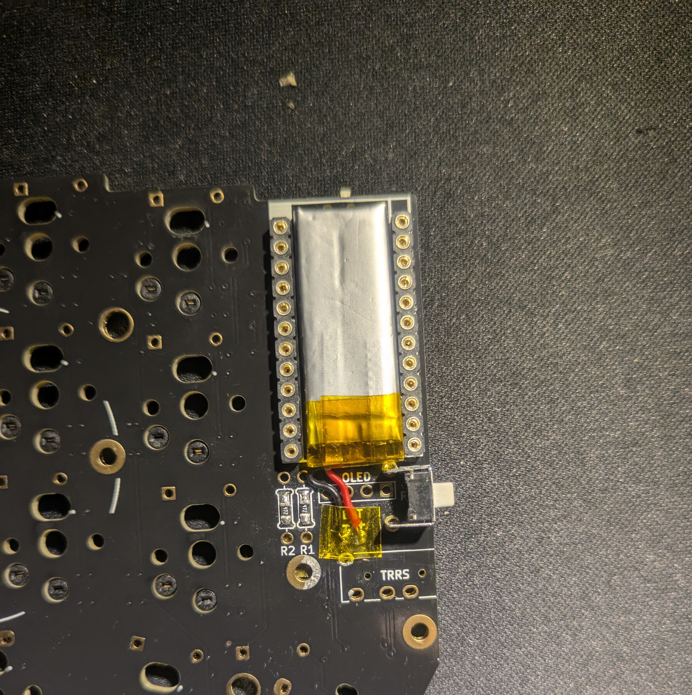

### Final assembly

Now the hard part is practically over. Lastly, we need to attach the switches and keycaps along with the top plate onto the PCB, and screw the top plate to the bottom plate. I added some covers for the microcontrollers because they look cool and might protect them from shorts. You can see that I also added some tenting legs to the bottom plate. This positions the keyboard in a way that reduces forearm pronation, aka the scissoring of the forearm bones. I got those from AliExpress as well. 

{{< carousel images="{img/final1.jpg,img/final2.jpg,img/final3.jpg,img/final4.jpg}">}}

## Flashing the firmware

For the final part of this project, I flashed the firmware onto the nice!nanos. Splitkb.com provides the precompiled default firmware for all their keyboards. If you want to modify the layout, and I assume you do, then you can follow the instructions [from ZMK's wiki](https://zmk.dev/docs/user-setup) to set up a new GitHub repository with ZMK CLI, modify the keymap and push it to be buit by GitHub Actions. I kind of contradict myself here because I went with the standard QWERTY layout instead of something more optimal like Dvorak. I did that to reduce the friction of switching to the new keyboard. I didn't want to spend more time learning a new layout. It is mostly about the physical arrangement of keys that makes the difference for me. I made a separate layer for numbers and special characters and a third for function keys. You can check out my layout below. If you have any questions, suggestions or feedback, feel free to comment below. As always, thanks for taking your time reading my blog!


