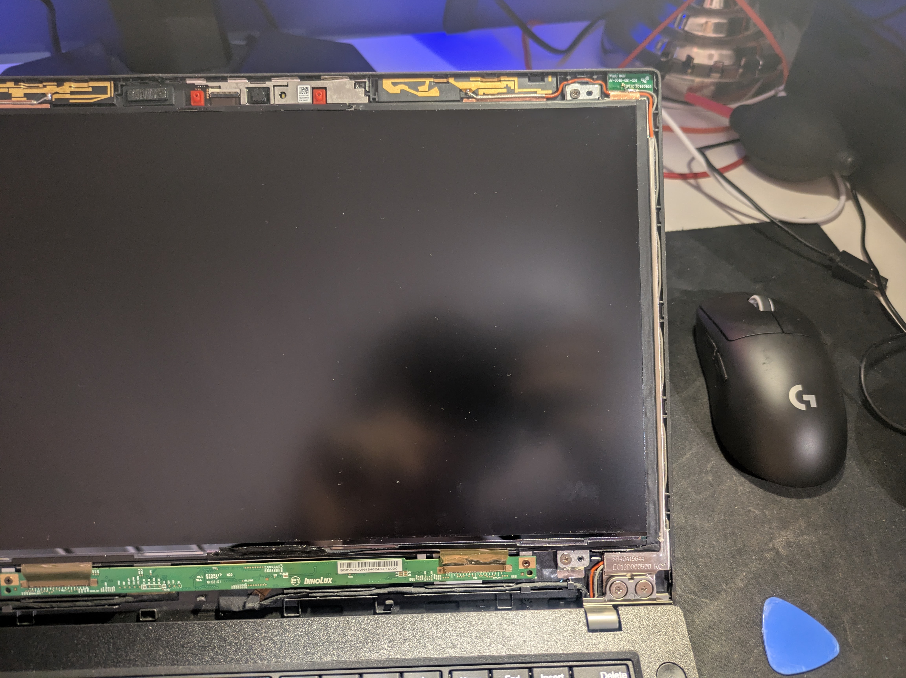
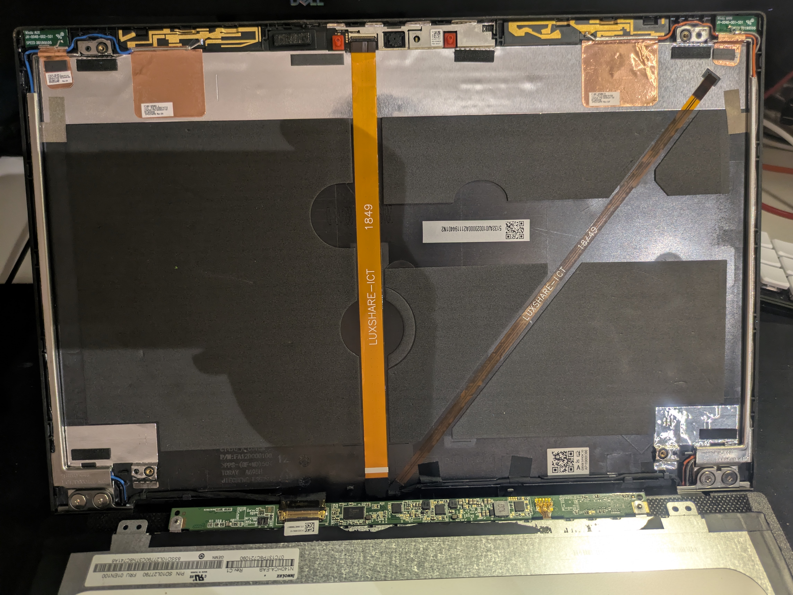
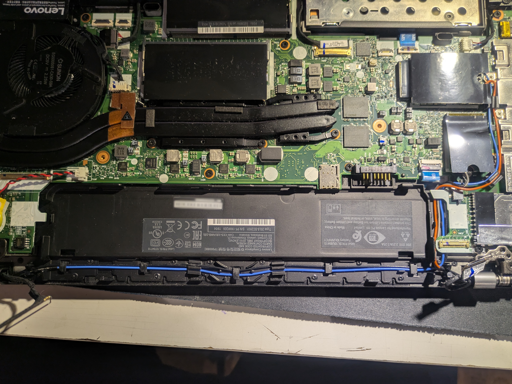
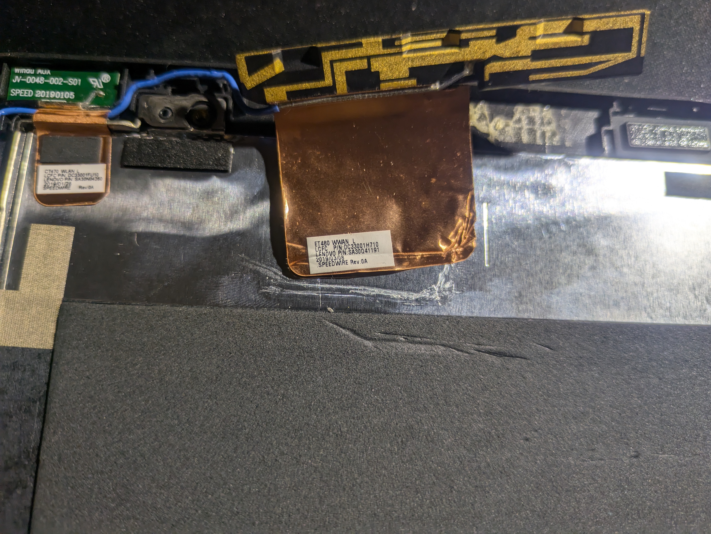
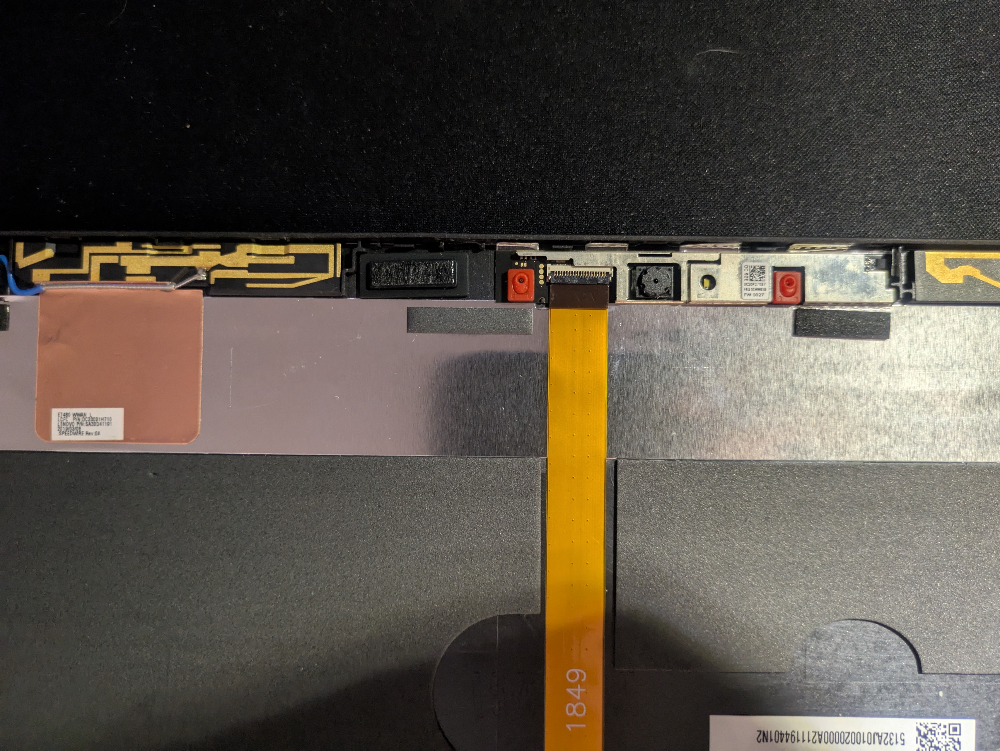
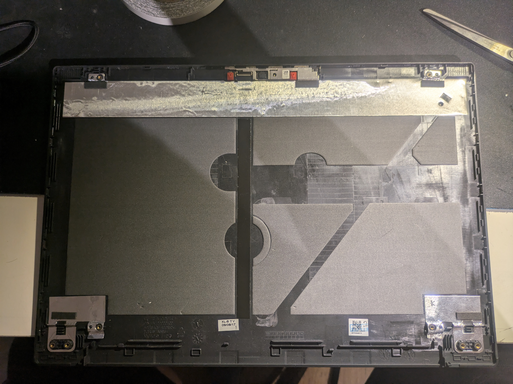
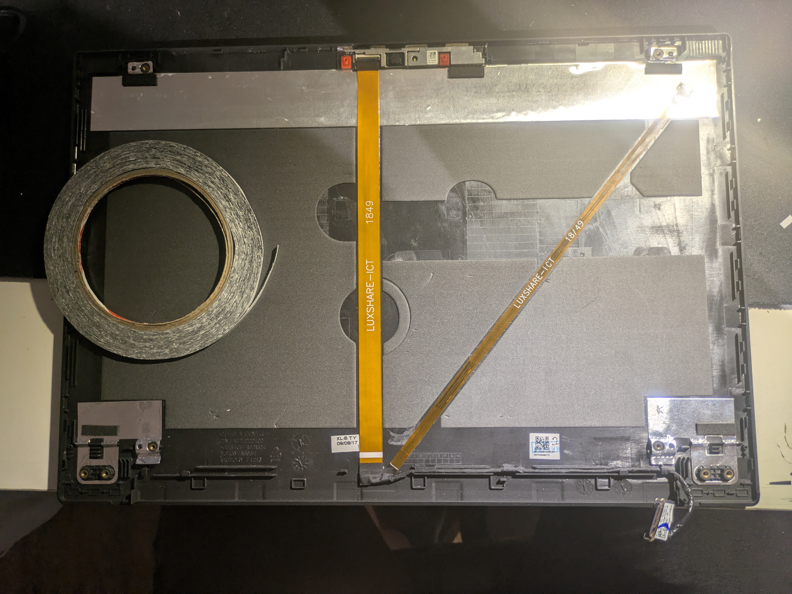
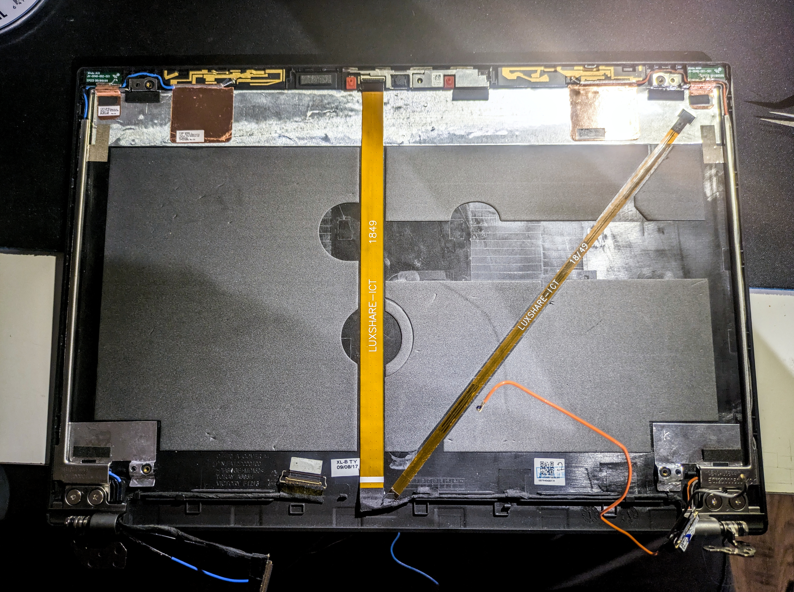
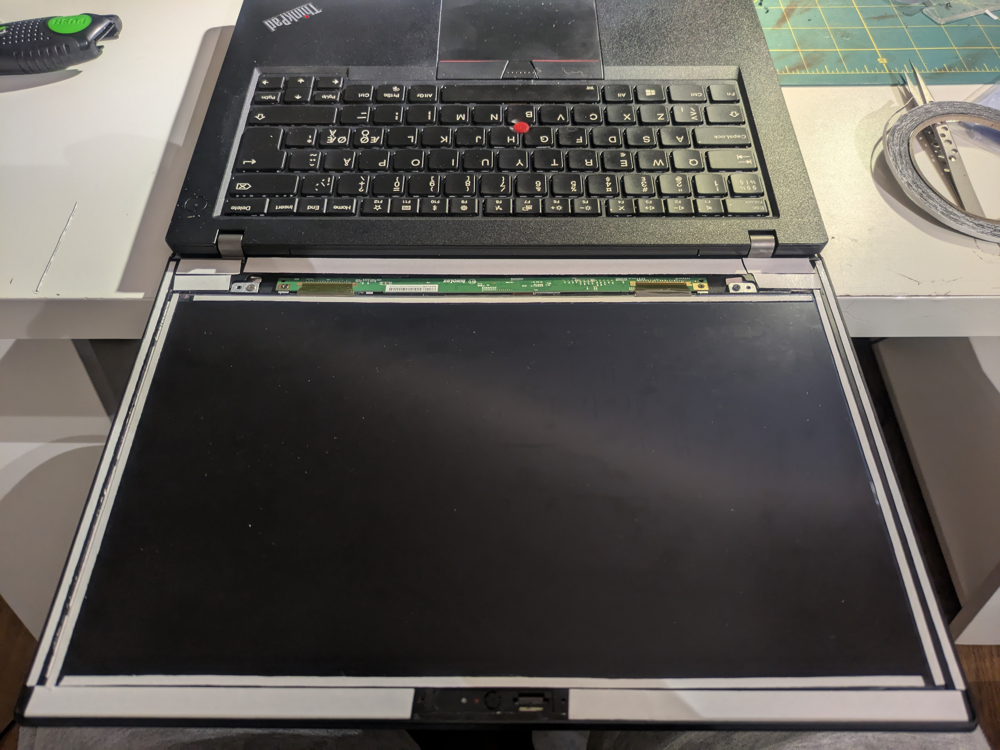
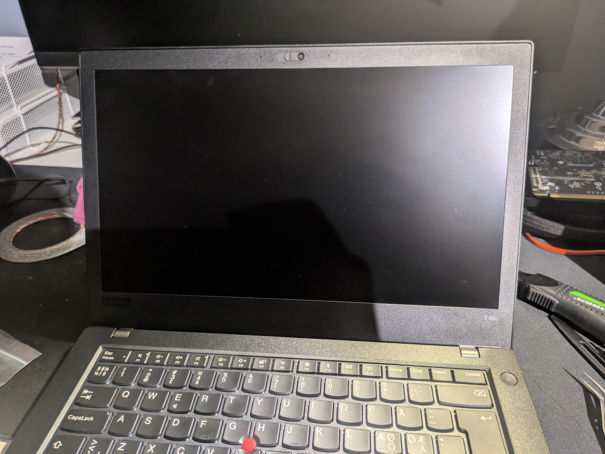

In this guide, we will be replacing the plastic top lid on a ThinkPad T480. We will go from finding the right product online to eventually installing it on your laptop. This guide assumes some previous experience with electronics repair, having the required tools and, most importantly steady and patient hands. If you feel uncomfortable doing the work yourself, it's best to consult someone with experience or have the repair done by a professional to avoid causing further damage.

## Background

The time has come again to get myself a laptop upgrade. The former just wasn't keeping up with my workflow and the battery capacity was dwindling. One of the main things I prefer in my portable computing devices are durability, repairability, upgradability and battery capacity. Thus, the natural choice was the T480. A proven workhorse featuring fully upgradeable DIMMs, a hot-swappable external battery, an NVMe slot and a slot for a WAN card if that's something you like. It is not however economical as an individual to buy a laptop like the T480 brand-new, but thankfully the used-laptop market is saturated with older but performant business-grade laptops for a fraction of the cost.

I got my T480 from an electronics reseller who first purchased it from an electronics repair company. The laptop came with a rather major dent in the top lid and was slightly bent too. Functionality was otherwise unaffected, and I could've left it as is, but my stubbornness and perfectionism naturally became the reason for this article.

## Getting the part number

Before we can go about purchasing a new replacement lid, the part number must be identified, and in this case, it involves removing the display first. At this point, I presume you have your screwdriver and spudgers ready, but any appropriately shaped object of lesser hardness than the material of the parts that you are prying apart will suffice. I do not recommend using anything made of metal as this risks damage to the parts. Remember to remove the external battery and disable the internal battery in the UEFI BIOS. You may also disconnect the internal battery entirely for good measure.

### Detach the front bezel

Start by carefully inserting a thin spudger or card between the inner edge of the bezel and the display and then work your way under until you have separated all of the glue, if any. Then insert your spudger in the seam between the outer edge of the bezel and the top lid. Starting from a corner of the display, slowly pry the parts apart until you hear a click. Continue prying along the edge of the bezel until you have fully detached all the latches holding the bezel in place. You should now be able to carefully take off the bezel, revealing the following.

### Remove the display

Next up: the display. Start by removing the four screws near each corner of the display. Then carefully rest the display on the keyboard so that the screen faces it like so. You can then disconnect the black display cable as shown in the image and store the display away in a safe place.

### Read the part number

In the previous image, you can see the part number or "P/N, for short," written out at the botton-left corner of the lid. In my case the number is `FA12D000100`. We can now use this information to verify that we are purchasing the right part.


**Warning!** It is very important that you buy a new component according to the part number that you have! In the case of the T480 there are two configurations available. One model with a plastic top lid and one with a magnesium composite top lid. Both come with different bezels that are not cross-compatible.


## Purchasing the replacement

Now this part is not something that you usually pick up from your local electronics retailer. There is of course the chance that repair shops have these lying around, but in this case we will be purchasing it from AliExpress. Another option which seems to have an abundance of them as of writing is eBay. On AliExpress, some listings can be ambiguous about whether the part you're buying is the plastic or the metal one. Some listings may straight up list the wrong part number. If it's not immediately obvious from the pictures or the description of the listing on which part is being sold then I recommend verifying this information from the seller. If the seller fails to provide a straight answer, then I'd steer clear of them. In the upcoming steps we will be installing the new lid where we will be using some thin double-sided acrylic tape to re-secure the components so I'd recommend picking up that as well in this step if you don't already have something similar.

## Removing the old lid

If the previous steps have been tedious then it is about to get even more involved. We are going to be removing the original components from the old lid which include the camera module and its cable, the LED and its cable, the antenna wires and hinges. When bought separately, the lid doesn't come with these parts pre-installed and I obviously want to reuse them.

### Disconnect the antenna wires

Unscrew the screws on the back cover of the laptop and open it up by prying from the edges gently. Disconnect the cables from the respective WLAN and WAN modules and undo the antenna wires up to the hinges.

### Unscrew hinges and disconnect other cables

After you've undone the cables and disconnected the two eDP cables near each hinge, you can unscrew the hinges from the bottom chassis. If you now unfold the laptop and lift the LCD assembly up from the hinges, it should separate. If you wish to have more detailed images of this step, I recommend checking out the guide on iFixit.

### Remove the antennas from the lid

Start by wedging a tool under the plastic piece with the golden traces on it and pry it apart. Then grab it and peel away the copper tape from the lid. Ideally you want to preserve the tape because we are going to be reattaching it to the new lid. Perform a similar procedure for the smaller connection as shown in the image. Also remove the beige-colored conductive tape in this step. Repeat for both antenna pairs.

### Remove the hinges and brackets from the lid

After you have removed the antenna connectors, you can unscrew the screws holding the hinges to the lid and remove them along with the two metal brackets on each side of the lid holding the wires down. You can now fully remove the antenna wires from the lid.

### Remove the ribbon cable

Start by disconnecting the ribbon cable from the module and slowly peel it off the lid. Once you've peeled to the intersection where the cable joins the LED cable you can then peel that cable, starting from where LED is. After that you can remove the rest of the cable that is routed near the bottom edge of the lid.

### Remove the camera module

Once you have fully removed the ribbon cable and stored it away, you can start removing the camera module. This one can be tricky so be patient. It is recommended to use multiple tools here to pry the module off from multiple points in order to apply even pressure. You should also take the piece of plastic on the left of the camera module and transfer it to the new lid as it adds some structural integrity.

## Installing the new lid

You should have now removed all the necessary components from the old lid. Now it's time to start putting them into the new lid that you hopefully received in the mail. Here we will need some of that tape for reinforcement if the glue isn't sticky enough anymore. We're basically retracing our steps in reverse, execpt that I will provide more detailed imagery of the steps involved.

### Reattach the camera module

### Reattach the ribbon cable

.")

### Reattach antennas, brackets and hinges

### Connect the display and bezel

### Put on the bezel and admire your work

.")

## Wrapping up

That was it! You could optionally leave the tape out when reattaching the bezel, but there may be a glaring gap between the bezel and the display. Note that I also replaced the bezel here, since it was worn out – hence the extra tape. You only need to put a thin ribbon of tape around the edges of the LCD. Now was this whole ordeal worth the experience? Totally! Was it worth the money and time invested? Maybe.
